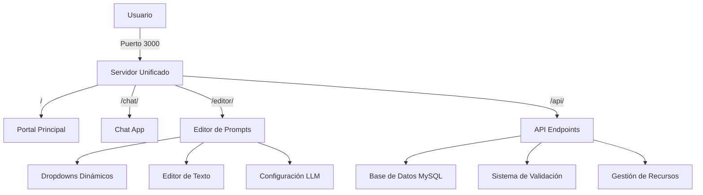
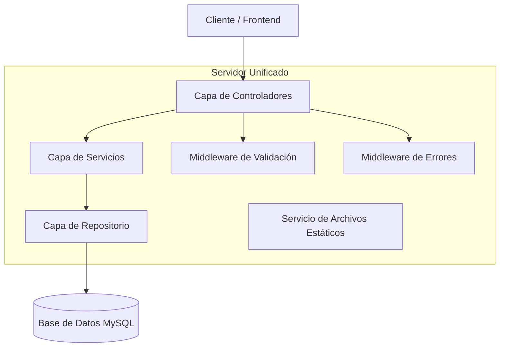
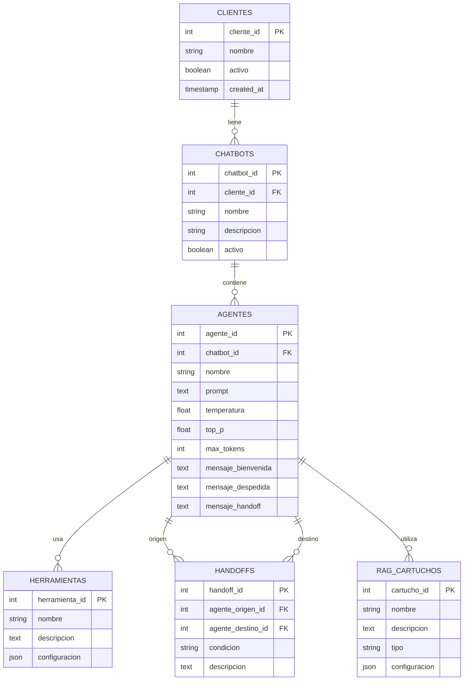

# Guía Técnica Completa - InteliChat Release 1.8

## 1. Arquitectura del Sistema

### 1.1 Diagrama de Arquitectura



### 1.2 Stack Tecnológico

- **Frontend**: HTML5, CSS3, JavaScript ES6+
- **Backend**: Node.js 18+ con Express.js 4.x
- **Base de Datos**: MySQL 8.0 / MariaDB 10.6+
- **Servidor**: Unificado con Express.js
- **APIs**: RESTful con JSON

## 2. Definiciones de Rutas

### 2.1 Rutas Frontend

| Ruta | Propósito | Archivo |
|------|-----------|---------|
| / | Portal principal con navegación | public/index.html |
| /chat/ | Aplicación de chat | public/chat/index.html |
| /editor/ | Editor de prompts | public/editor/index.html |

### 2.2 Rutas API

| Método | Ruta | Propósito |
|--------|------|-----------|
| GET | /api/health | Health check del servidor |
| GET | /api/clients | Lista todos los clientes |
| GET | /api/agents/clients | Clientes para el editor |
| GET | /api/agents/chatbots | Chatbots por cliente |
| GET | /api/agents/by-client-chatbot | Agentes por cliente y chatbot |
| GET | /api/agents/:id | Datos específicos del agente |
| GET | /api/agents/:id/tools-editor | Herramientas y formularios |
| GET | /api/agents/:id/handoffs | Handoffs del agente |
| GET | /api/agents/:id/rag-cartridges | Cartuchos RAG del agente |
| POST | /api/agents/:id/validate | Validación de prompts |
| PUT | /api/agents/:id/prompt | Actualización de prompts |

## 3. Definiciones de API

### 3.1 API Core - Clientes

#### GET /api/clients
Obtiene la lista de todos los clientes disponibles.

**Request:**
```http
GET /api/clients
```

**Response:**
```json
[
  {
    "cliente_id": 1,
    "nombre": "Cliente Demo",
    "activo": true
  }
]
```

#### GET /api/agents/clients
Obtiene clientes específicamente para el editor de prompts.

**Request:**
```http
GET /api/agents/clients
```

**Response:**
```json
[
  {
    "cliente_id": 1,
    "nombre": "Cliente Demo"
  }
]
```

### 3.2 API Core - Chatbots

#### GET /api/agents/chatbots
Obtiene chatbots filtrados por cliente.

**Request:**
```http
GET /api/agents/chatbots?clienteId=1
```

**Response:**
```json
[
  {
    "chatbot_id": 1,
    "nombre": "Chatbot Demo",
    "cliente_id": 1
  }
]
```

### 3.3 API Core - Agentes

#### GET /api/agents/by-client-chatbot
Obtiene agentes filtrados por cliente y chatbot.

**Request:**
```http
GET /api/agents/by-client-chatbot?clienteId=1&chatbotId=1
```

**Response:**
```json
[
  {
    "agente_id": 107,
    "nombre": "Agente INFO",
    "tipo": "coordinador"
  }
]
```

#### GET /api/agents/:id
Obtiene datos completos de un agente específico.

**Request:**
```http
GET /api/agents/107
```

**Response:**
```json
{
  "agente_id": 107,
  "nombre": "Agente INFO",
  "prompt": "Eres un agente coordinador...",
  "temperatura": 0.7,
  "top_p": 0.9,
  "max_tokens": 2000,
  "mensaje_bienvenida": "¡Hola! Soy tu asistente...",
  "mensaje_despedida": "¡Hasta luego!",
  "mensaje_handoff": "Te transfiero con un especialista..."
}
```

### 3.4 API de Recursos

#### GET /api/agents/:id/tools-editor
Obtiene herramientas y formularios del agente.

**Response:**
```json
{
  "tools": [
    {
      "herramienta_id": 1,
      "nombre": "Búsqueda Web",
      "descripcion": "Realiza búsquedas en internet"
    }
  ],
  "forms": [
    {
      "formulario_id": 1,
      "nombre": "Datos Cliente",
      "campos": ["nombre", "email", "telefono"]
    }
  ]
}
```

#### GET /api/agents/:id/handoffs
Obtiene handoffs disponibles para el agente.

**Response:**
```json
[
  {
    "handoff_id": 1,
    "agente_origen_id": 107,
    "agente_destino_id": 108,
    "condicion": "consulta_tecnica",
    "agente_destino_nombre": "Agente Técnico"
  }
]
```

#### GET /api/agents/:id/rag-cartridges
Obtiene cartuchos RAG asociados al agente.

**Response:**
```json
[
  {
    "cartucho_id": 1,
    "nombre": "Base Conocimiento",
    "descripcion": "Documentación técnica del producto",
    "tipo": "documentos"
  }
]
```

### 3.5 API de Validación

#### POST /api/agents/:id/validate
Valida el prompt de un agente y retorna un reporte detallado.

**Request:**
```json
{
  "prompt": "Eres un agente coordinador que ayuda a los usuarios...",
  "temperatura": 0.7,
  "top_p": 0.9,
  "max_tokens": 2000
}
```

**Response:**
```json
{
  "isValid": true,
  "score": 85,
  "issues": [
    "El prompt podría ser más específico en las instrucciones"
  ],
  "suggestions": [
    "Agregar ejemplos de interacciones típicas",
    "Definir mejor el tono de respuesta"
  ],
  "strengths": [
    "Instrucciones claras sobre el rol",
    "Buena estructura del prompt"
  ]
}
```

### 3.6 API de Actualización

#### PUT /api/agents/:id/prompt
Actualiza el prompt y parámetros de un agente.

**Request:**
```json
{
  "prompt": "Nuevo prompt actualizado...",
  "temperatura": 0.8,
  "top_p": 0.95,
  "max_tokens": 2500,
  "mensaje_bienvenida": "Nuevo mensaje de bienvenida",
  "mensaje_despedida": "Nuevo mensaje de despedida",
  "mensaje_handoff": "Nuevo mensaje de handoff"
}
```

**Response:**
```json
{
  "success": true,
  "message": "Agente actualizado correctamente",
  "agente_id": 107
}
```

## 4. Arquitectura del Servidor

### 4.1 Diagrama de Capas



### 4.2 Estructura del Servidor

```javascript
// unified-server.js - Estructura principal
const express = require('express');
const mysql = require('mysql2/promise');
const path = require('path');

// Configuración del pool de conexiones
const pool = mysql.createPool({
    host: process.env.DB_HOST,
    user: process.env.DB_USER,
    password: process.env.DB_PASSWORD,
    database: process.env.DB_NAME,
    waitForConnections: true,
    connectionLimit: 10,
    queueLimit: 0
});

// Middleware de archivos estáticos
app.use(express.static('public'));
app.use(express.json());

// Rutas API
app.get('/api/health', healthCheck);
app.get('/api/clients', getClients);
app.get('/api/agents/:id', getAgentById);
app.post('/api/agents/:id/validate', validatePrompt);
app.put('/api/agents/:id/prompt', updateAgentPrompt);

// Rutas de páginas
app.get('/', (req, res) => res.sendFile(path.join(__dirname, 'public', 'index.html')));
app.get('/chat/', (req, res) => res.sendFile(path.join(__dirname, 'public', 'chat', 'index.html')));
app.get('/editor/', (req, res) => res.sendFile(path.join(__dirname, 'public', 'editor', 'index.html')));
```

## 5. Modelo de Datos

### 5.1 Diagrama Entidad-Relación



### 5.2 Definiciones DDL

#### Tabla Clientes
```sql
CREATE TABLE clientes (
    cliente_id INT PRIMARY KEY AUTO_INCREMENT,
    nombre VARCHAR(255) NOT NULL,
    activo BOOLEAN DEFAULT TRUE,
    created_at TIMESTAMP DEFAULT CURRENT_TIMESTAMP,
    updated_at TIMESTAMP DEFAULT CURRENT_TIMESTAMP ON UPDATE CURRENT_TIMESTAMP
);

-- Índices
CREATE INDEX idx_clientes_activo ON clientes(activo);
CREATE INDEX idx_clientes_nombre ON clientes(nombre);
```

#### Tabla Chatbots
```sql
CREATE TABLE chatbots (
    chatbot_id INT PRIMARY KEY AUTO_INCREMENT,
    cliente_id INT NOT NULL,
    nombre VARCHAR(255) NOT NULL,
    descripcion TEXT,
    activo BOOLEAN DEFAULT TRUE,
    created_at TIMESTAMP DEFAULT CURRENT_TIMESTAMP,
    FOREIGN KEY (cliente_id) REFERENCES clientes(cliente_id)
);

-- Índices
CREATE INDEX idx_chatbots_cliente ON chatbots(cliente_id);
CREATE INDEX idx_chatbots_activo ON chatbots(activo);
```

#### Tabla Agentes
```sql
CREATE TABLE agentes (
    agente_id INT PRIMARY KEY AUTO_INCREMENT,
    chatbot_id INT NOT NULL,
    nombre VARCHAR(255) NOT NULL,
    prompt TEXT NOT NULL,
    temperatura DECIMAL(3,2) DEFAULT 0.70,
    top_p DECIMAL(3,2) DEFAULT 0.90,
    max_tokens INT DEFAULT 2000,
    mensaje_bienvenida TEXT,
    mensaje_despedida TEXT,
    mensaje_handoff TEXT,
    activo BOOLEAN DEFAULT TRUE,
    created_at TIMESTAMP DEFAULT CURRENT_TIMESTAMP,
    updated_at TIMESTAMP DEFAULT CURRENT_TIMESTAMP ON UPDATE CURRENT_TIMESTAMP,
    FOREIGN KEY (chatbot_id) REFERENCES chatbots(chatbot_id)
);

-- Índices
CREATE INDEX idx_agentes_chatbot ON agentes(chatbot_id);
CREATE INDEX idx_agentes_activo ON agentes(activo);
CREATE INDEX idx_agentes_nombre ON agentes(nombre);
```

#### Tabla Herramientas
```sql
CREATE TABLE herramientas (
    herramienta_id INT PRIMARY KEY AUTO_INCREMENT,
    nombre VARCHAR(255) NOT NULL,
    descripcion TEXT,
    configuracion JSON,
    activo BOOLEAN DEFAULT TRUE,
    created_at TIMESTAMP DEFAULT CURRENT_TIMESTAMP
);

-- Tabla de relación agentes-herramientas
CREATE TABLE agente_herramientas (
    agente_id INT,
    herramienta_id INT,
    PRIMARY KEY (agente_id, herramienta_id),
    FOREIGN KEY (agente_id) REFERENCES agentes(agente_id),
    FOREIGN KEY (herramienta_id) REFERENCES herramientas(herramienta_id)
);
```

#### Tabla Handoffs
```sql
CREATE TABLE handoffs (
    handoff_id INT PRIMARY KEY AUTO_INCREMENT,
    agente_origen_id INT NOT NULL,
    agente_destino_id INT NOT NULL,
    condicion VARCHAR(255),
    descripcion TEXT,
    activo BOOLEAN DEFAULT TRUE,
    created_at TIMESTAMP DEFAULT CURRENT_TIMESTAMP,
    FOREIGN KEY (agente_origen_id) REFERENCES agentes(agente_id),
    FOREIGN KEY (agente_destino_id) REFERENCES agentes(agente_id)
);

-- Índices
CREATE INDEX idx_handoffs_origen ON handoffs(agente_origen_id);
CREATE INDEX idx_handoffs_destino ON handoffs(agente_destino_id);
```

#### Tabla RAG Cartuchos
```sql
CREATE TABLE rag_cartuchos (
    cartucho_id INT PRIMARY KEY AUTO_INCREMENT,
    nombre VARCHAR(255) NOT NULL,
    descripcion TEXT,
    tipo ENUM('documentos', 'web', 'base_datos') DEFAULT 'documentos',
    configuracion JSON,
    activo BOOLEAN DEFAULT TRUE,
    created_at TIMESTAMP DEFAULT CURRENT_TIMESTAMP
);

-- Tabla de relación agentes-rag_cartuchos
CREATE TABLE agente_rag_cartuchos (
    agente_id INT,
    cartucho_id INT,
    PRIMARY KEY (agente_id, cartucho_id),
    FOREIGN KEY (agente_id) REFERENCES agentes(agente_id),
    FOREIGN KEY (cartucho_id) REFERENCES rag_cartuchos(cartucho_id)
);
```

### 5.3 Datos de Ejemplo

```sql
-- Insertar cliente de ejemplo
INSERT INTO clientes (nombre, activo) VALUES 
('Cliente Demo', TRUE);

-- Insertar chatbot de ejemplo
INSERT INTO chatbots (cliente_id, nombre, descripcion, activo) VALUES 
(1, 'Chatbot Demo', 'Chatbot de demostración', TRUE);

-- Insertar agente de ejemplo
INSERT INTO agentes (
    chatbot_id, nombre, prompt, temperatura, top_p, max_tokens,
    mensaje_bienvenida, mensaje_despedida, mensaje_handoff
) VALUES (
    1, 
    'Agente INFO',
    'Eres un agente coordinador inteligente que ayuda a los usuarios a resolver sus consultas de manera eficiente.',
    0.70,
    0.90,
    2000,
    '¡Hola! Soy tu asistente virtual. ¿En qué puedo ayudarte hoy?',
    '¡Hasta luego! Ha sido un placer ayudarte.',
    'Te voy a transferir con un especialista que podrá ayudarte mejor.'
);

-- Insertar herramienta de ejemplo
INSERT INTO herramientas (nombre, descripcion, configuracion) VALUES 
('Búsqueda Web', 'Realiza búsquedas en internet', '{"api": "google", "max_results": 5}');

-- Relacionar agente con herramienta
INSERT INTO agente_herramientas (agente_id, herramienta_id) VALUES (1, 1);

-- Insertar cartucho RAG de ejemplo
INSERT INTO rag_cartuchos (nombre, descripcion, tipo, configuracion) VALUES 
('Base Conocimiento', 'Documentación técnica del producto', 'documentos', '{"path": "/docs", "format": "pdf"}');

-- Relacionar agente con cartucho RAG
INSERT INTO agente_rag_cartuchos (agente_id, cartucho_id) VALUES (1, 1);
```

## 6. Configuración y Despliegue

### 6.1 Variables de Entorno

```env
# Base de Datos
DB_HOST=localhost
DB_PORT=3306
DB_USER=intelichat_user
DB_PASSWORD=secure_password
DB_NAME=intelichat

# Servidor
PORT=3000
NODE_ENV=development

# APIs LLM
GROQ_API_KEY=your_groq_api_key
OPENAI_API_KEY=your_openai_api_key

# Configuración de Validación
VALIDATION_TIMEOUT=5000
MAX_PROMPT_LENGTH=10000
```

### 6.2 Instalación y Configuración

```bash
# 1. Clonar repositorio
git clone <repository-url>
cd intelichat

# 2. Instalar dependencias
npm install

# 3. Configurar variables de entorno
cp .env.example .env
# Editar .env con las credenciales correctas

# 4. Configurar base de datos
mysql -u root -p < db.sql

# 5. Ejecutar servidor
node unified-server.js
```

### 6.3 Estructura de Archivos

```
intelichat/
├── unified-server.js           # Servidor principal
├── db.sql                      # Esquema de base de datos
├── .env                        # Variables de entorno
├── .env.example               # Plantilla de variables
├── package.json               # Dependencias del proyecto
├── public/                    # Archivos estáticos
│   ├── index.html            # Portal principal
│   ├── chat/                 # Chat app
│   │   ├── index.html
│   │   └── app.js
│   └── editor/               # Editor de prompts
│       ├── index.html
│       ├── app.js
│       └── styles.css
├── docs/                     # Documentación
└── intelli_backend/          # Backend legacy (referencia)
```

## 7. Guía de Desarrollo

### 7.1 Agregar Nuevos Endpoints

```javascript
// Ejemplo: Agregar endpoint para métricas
app.get('/api/agents/:id/metrics', async (req, res) => {
    try {
        const { id } = req.params;
        
        const [rows] = await pool.execute(
            'SELECT * FROM metricas WHERE agente_id = ?',
            [id]
        );
        
        res.json(rows);
    } catch (error) {
        console.error('Error fetching metrics:', error);
        res.status(500).json({ error: 'Error interno del servidor' });
    }
});
```

### 7.2 Modificar el Editor de Prompts

```javascript
// Ejemplo: Agregar nueva funcionalidad al editor
function addNewFeature() {
    // 1. Agregar elementos UI
    const newButton = document.createElement('button');
    newButton.textContent = 'Nueva Funcionalidad';
    newButton.onclick = handleNewFeature;
    
    // 2. Agregar al DOM
    document.getElementById('toolbar').appendChild(newButton);
}

async function handleNewFeature() {
    try {
        const response = await fetch(`/api/agents/${agentId}/new-feature`, {
            method: 'POST',
            headers: { 'Content-Type': 'application/json' },
            body: JSON.stringify({ data: 'example' })
        });
        
        const result = await response.json();
        console.log('Feature result:', result);
    } catch (error) {
        console.error('Error:', error);
    }
}
```

### 7.3 Mejores Prácticas

#### Manejo de Errores
```javascript
// Siempre usar try-catch en endpoints async
app.get('/api/example', async (req, res) => {
    try {
        // Lógica del endpoint
        const result = await someAsyncOperation();
        res.json(result);
    } catch (error) {
        console.error('Error in /api/example:', error);
        res.status(500).json({ 
            error: 'Error interno del servidor',
            message: error.message 
        });
    }
});
```

#### Validación de Parámetros
```javascript
// Validar parámetros de entrada
app.post('/api/agents/:id/update', async (req, res) => {
    const { id } = req.params;
    const { prompt, temperatura } = req.body;
    
    // Validaciones
    if (!id || isNaN(id)) {
        return res.status(400).json({ error: 'ID de agente inválido' });
    }
    
    if (!prompt || prompt.trim().length === 0) {
        return res.status(400).json({ error: 'Prompt requerido' });
    }
    
    if (temperatura < 0 || temperatura > 1) {
        return res.status(400).json({ error: 'Temperatura debe estar entre 0 y 1' });
    }
    
    // Continuar con la lógica...
});
```

## 8. Troubleshooting

### 8.1 Problemas Comunes

#### Error de Conexión a Base de Datos
```bash
# Verificar variables de entorno
echo $DB_HOST $DB_USER $DB_NAME

# Probar conexión manual
mysql -h $DB_HOST -u $DB_USER -p $DB_NAME
```

#### Puerto 3000 en Uso
```bash
# Encontrar proceso usando el puerto
netstat -tulpn | grep :3000
lsof -i :3000

# Terminar proceso
kill -9 <PID>
```

#### Dropdowns No Cargan Datos
1. Verificar que la base de datos tenga datos
2. Comprobar logs del servidor para errores de API
3. Verificar que las consultas SQL sean correctas
4. Revisar la consola del navegador para errores JavaScript

### 8.2 Logs y Debugging

```javascript
// Agregar logging detallado
console.log(`[${new Date().toISOString()}] API Call: ${req.method} ${req.path}`);
console.log('Request params:', req.params);
console.log('Request body:', req.body);
```

### 8.3 Monitoreo

```javascript
// Health check mejorado
app.get('/api/health', async (req, res) => {
    try {
        // Verificar conexión a BD
        await pool.execute('SELECT 1');
        
        res.json({
            status: 'healthy',
            timestamp: new Date().toISOString(),
            uptime: process.uptime(),
            memory: process.memoryUsage()
        });
    } catch (error) {
        res.status(500).json({
            status: 'unhealthy',
            error: error.message
        });
    }
});
```