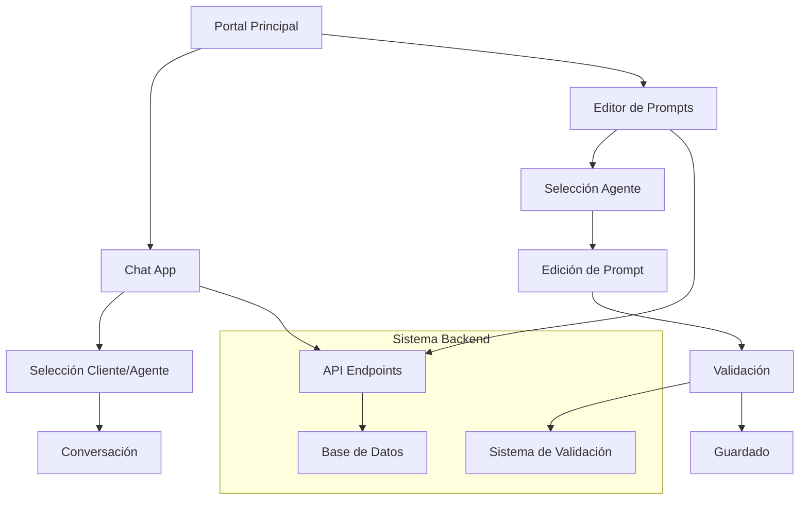

# PRD InteliChat Release 1.8 - Sistema Unificado

## 1. Resumen Ejecutivo

InteliChat Release 1.8 es un sistema unificado de chatbot conversacional que consolida todas las funcionalidades en un servidor único, con un editor de prompts completamente funcional y una arquitectura multi-agente robusta.

### Objetivos Principales
- **Unificación**: Servidor único en puerto 3000 para todas las aplicaciones
- **Editor Avanzado**: Herramienta completa para desarrollo y validación de prompts
- **Experiencia Integrada**: Interfaz intuitiva para gestión de agentes conversacionales
- **Arquitectura Escalable**: Sistema multi-agente con flujo de control predecible

## 2. Características Principales

### 2.1 Roles de Usuario

| Rol | Método de Acceso | Permisos Principales |
|-----|------------------|---------------------|
| Desarrollador | Acceso directo al editor | Crear, editar y validar prompts; gestionar agentes |
| Usuario Final | Chat app | Interactuar con chatbots configurados |
| Administrador | Acceso completo | Gestión de clientes, chatbots y configuración del sistema |

### 2.2 Módulos Funcionales

El sistema InteliChat Release 1.8 consta de las siguientes páginas principales:

1. **Portal Principal**: Página de inicio con acceso a todas las aplicaciones
2. **Chat App**: Interfaz conversacional para usuarios finales
3. **Editor de Prompts**: Herramienta avanzada para desarrollo y gestión de agentes
4. **API Endpoints**: Servicios backend para todas las funcionalidades

### 2.3 Detalles de Páginas

| Página | Módulo | Descripción de Funcionalidades |
|--------|--------|--------------------------------|
| Portal Principal | Navegación | Acceso directo a Chat App y Editor de Prompts |
| Chat App | Interfaz Conversacional | Selección de cliente/agente, chat en tiempo real, soporte multiidioma |
| Editor de Prompts | Gestión de Agentes | Dropdowns dinámicos para clientes, chatbots y agentes |
| Editor de Prompts | Editor de Texto | Edición de prompts con sintaxis highlighting |
| Editor de Prompts | Validación | Sistema de validación contextual con reportes detallados |
| Editor de Prompts | Configuración LLM | Parámetros de temperatura, top_p, max_tokens |
| Editor de Prompts | Recursos | Visualización de herramientas, handoffs y cartuchos RAG |
| Editor de Prompts | Mensajes | Gestión de mensajes de bienvenida, despedida y handoffs |

## 3. Flujo de Procesos Principales

### Flujo del Desarrollador
1. Accede al Portal Principal (http://localhost:3000)
2. Navega al Editor de Prompts
3. Selecciona cliente, chatbot y agente
4. Edita el prompt del agente
5. Configura parámetros LLM
6. Valida el prompt con el sistema de validación
7. Guarda los cambios

### Flujo del Usuario Final
1. Accede al Chat App (http://localhost:3000/chat/)
2. Selecciona cliente y agente
3. Inicia conversación
4. Interactúa con el sistema multi-agente



## 4. Diseño de Interfaz de Usuario

### 4.1 Estilo de Diseño

- **Colores Primarios**: Azul (#007bff), Verde (#28a745)
- **Colores Secundarios**: Gris (#6c757d), Blanco (#ffffff)
- **Estilo de Botones**: Redondeados con efectos hover
- **Tipografía**: Sans-serif, tamaños 14px-18px para contenido
- **Layout**: Diseño de pestañas para el editor, cards para recursos
- **Iconos**: Font Awesome para consistencia visual

### 4.2 Diseño de Páginas

| Página | Módulo | Elementos UI |
|--------|--------|--------------|
| Portal Principal | Navegación | Header con logo, cards de acceso rápido, footer informativo |
| Chat App | Interfaz Chat | Dropdowns de selección, área de mensajes, input de texto |
| Editor de Prompts | Pestañas | Navegación por pestañas (Prompt, Parámetros, Mensajes) |
| Editor de Prompts | Dropdowns | Selección dinámica de cliente, chatbot, agente |
| Editor de Prompts | Editor | Textarea con sintaxis highlighting, botones de acción |
| Editor de Prompts | Validación | Modal con reporte detallado, sugerencias aplicables |
| Editor de Prompts | Recursos | Cards expandibles para herramientas, handoffs, RAG |

### 4.3 Responsividad

- **Desktop-first**: Optimizado para pantallas de escritorio (1200px+)
- **Adaptación móvil**: Responsive design para tablets y móviles
- **Interacción táctil**: Botones y elementos optimizados para touch

## 5. Especificaciones Técnicas

### 5.1 Arquitectura del Sistema

- **Frontend**: HTML5, CSS3, JavaScript vanilla
- **Backend**: Node.js con Express.js
- **Base de Datos**: MySQL/MariaDB
- **Servidor**: Unificado en puerto 3000
- **APIs**: RESTful endpoints para todas las funcionalidades

### 5.2 Endpoints API Principales

```
GET  /api/clients                    # Lista de clientes
GET  /api/agents/clients             # Clientes para editor
GET  /api/agents/chatbots            # Chatbots por cliente
GET  /api/agents/by-client-chatbot   # Agentes por cliente y chatbot
GET  /api/agents/:id                 # Datos del agente
POST /api/agents/:id/validate        # Validación de prompts
PUT  /api/agents/:id/prompt          # Actualización de prompts
```

### 5.3 Estructura de Datos

#### Agente
```json
{
  "agente_id": "number",
  "nombre": "string",
  "prompt": "string",
  "temperatura": "number",
  "top_p": "number",
  "max_tokens": "number",
  "mensaje_bienvenida": "string",
  "mensaje_despedida": "string"
}
```

#### Reporte de Validación
```json
{
  "isValid": "boolean",
  "score": "number",
  "issues": ["array"],
  "suggestions": ["array"],
  "strengths": ["array"]
}
```

## 6. Criterios de Aceptación

### 6.1 Funcionalidades Críticas
- [x] ✅ Servidor unificado funcionando en puerto 3000
- [x] ✅ Portal principal con navegación a todas las apps
- [x] ✅ Chat app completamente funcional
- [x] ✅ Editor de prompts con todas las funcionalidades
- [x] ✅ Sistema de validación implementado
- [x] ✅ Dropdowns dinámicos funcionando
- [x] ✅ Guardado de prompts y parámetros
- [x] ✅ Visualización de recursos (herramientas, RAG, handoffs)

### 6.2 Rendimiento
- Tiempo de carga inicial < 2 segundos
- Respuesta de API < 500ms
- Validación de prompts < 3 segundos

### 6.3 Usabilidad
- Interfaz intuitiva sin necesidad de documentación
- Feedback visual inmediato en todas las acciones
- Manejo de errores con mensajes claros

## 7. Roadmap de Desarrollo

### Fase 1: Consolidación (COMPLETADA)
- [x] ✅ Implementación del servidor unificado
- [x] ✅ Editor de prompts completamente funcional
- [x] ✅ Sistema de validación integrado
- [x] ✅ API endpoints completos

### Fase 2: Expansión de Funcionalidades
- [ ] Panel de administración web
- [ ] Métricas y analytics de conversación
- [ ] Nuevas herramientas para agentes
- [ ] Mejoras en el sistema RAG

### Fase 3: Escalabilidad y Optimización
- [ ] Arquitectura distribuida
- [ ] Monitoreo avanzado
- [ ] Optimizaciones de rendimiento
- [ ] Integración con servicios externos

## 8. Riesgos y Mitigaciones

| Riesgo | Probabilidad | Impacto | Mitigación |
|--------|--------------|---------|------------|
| Sobrecarga del servidor unificado | Media | Alto | Monitoreo de recursos y optimización |
| Complejidad de la validación | Baja | Medio | Validación incremental y feedback |
| Escalabilidad de la BD | Media | Alto | Optimización de consultas y índices |

## 9. Métricas de Éxito

- **Adopción**: 100% de funcionalidades del editor utilizables
- **Rendimiento**: < 2s tiempo de carga, < 500ms respuesta API
- **Calidad**: 0 errores críticos en producción
- **Usabilidad**: Feedback positivo de desarrolladores y usuarios