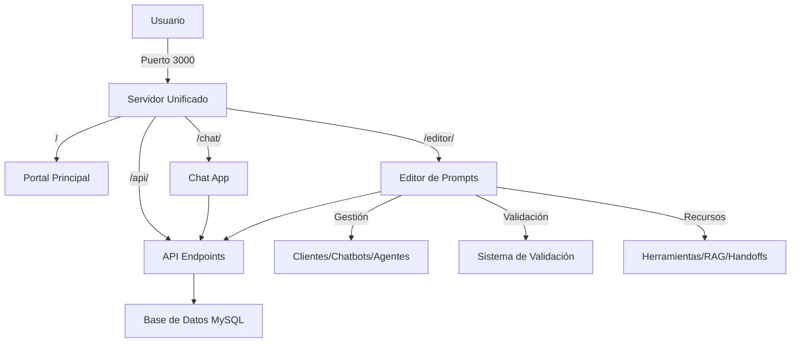

# InteliChat Release 1.8 🧠
> **Sistema Unificado de Chatbot Conversacional**: Plataforma completa con editor de prompts avanzado y arquitectura multi-agente.

## 🎯 Estado Actual del Sistema

**Release 1.8** consolida todas las funcionalidades en un servidor unificado con editor de prompts completamente funcional y sistema de validación inteligente.

### ✅ Funcionalidades Implementadas
- **Servidor Unificado**: Todas las aplicaciones desde `http://localhost:3000`
- **Editor de Prompts Avanzado**: Desarrollo, validación y mejora de prompts
- **API Endpoints Completos**: Gestión integral de agentes, herramientas y RAG
- **Validación Inteligente**: Sistema contextual de validación de prompts
- **Arquitectura Multi-Agente**: Modelo "hub-and-spoke" robusto y predecible

## 🚀 Estado del Despliegue

[](https://github.com/rbugari/intelichat/actions/workflows/deploy.yml)

El despliegue de InteliChat se gestiona automáticamente a través de GitHub Actions.

*   **`main`**: Rama de producción. Cualquier `push` a `main` disparará un despliegue automático a Railway (backend) y Vercel (frontend).
*   **`dev`**: Rama de desarrollo. Todos los nuevos cambios deben realizarse aquí. Los `push` a `dev` **no** dispararán un despliegues automáticos.

Para más detalles sobre el proceso de despliegue y la configuración de secretos, consulta [DEPLOYMENT.md](DEPLOYMENT.md).

## 🚀 Acceso Rápido

```
🌐 Portal Principal:     http://localhost:3000
💬 Chat App:            http://localhost:3000/chat/
📝 Editor de Prompts:   http://localhost:3000/editor/
🔧 API Backend:         http://localhost:3000/api/
💚 Health Check:        http://localhost:3000/api/health
```

## ✨ Nuevas Características Release 1.8

### 🎛️ Servidor Unificado
- **Un Solo Puerto**: Todo el sistema funciona desde `http://localhost:3000`
- **Gestión Centralizada**: Portal principal con acceso directo a todas las aplicaciones
- **API Unificada**: Todos los endpoints disponibles desde una sola instancia

## 📋 Funcionalidades Principales

### 🎛️ Editor de Prompts
- **Interfaz Completa**: Editor con pestañas para prompts, parámetros y mensajes
- **Dropdowns Dinámicos**: Selección de clientes, chatbots y agentes
- **Validación en Tiempo Real**: Sistema contextual de validación
- **Gestión de Recursos**: Herramientas, handoffs y cartuchos RAG
- **Parámetros LLM**: Configuración de temperatura, top_p y max_tokens
- **Mensajes Multiidioma**: Gestión completa de mensajes del sistema

### 💬 Chat App
- **Interfaz Conversacional**: Chat en tiempo real con agentes
- **Selección de Agentes**: Dropdown dinámico de clientes y agentes
- **Soporte Multiidioma**: Mensajes en español e inglés
- **Historial de Conversaciones**: Gestión completa del historial

### 🔧 API Endpoints
```
GET  /api/clients                           # Lista de clientes
GET  /api/agents/clients                    # Clientes para editor
GET  /api/agents/chatbots                   # Chatbots por cliente
GET  /api/agents/by-client-chatbot          # Agentes por cliente y chatbot
GET  /api/agents/:id                        # Datos específicos del agente
GET  /api/agents/:id/tools-editor           # Herramientas y formularios
GET  /api/agents/:id/handoffs               # Handoffs del agente
GET  /api/agents/:id/rag-cartridges         # Cartuchos RAG del agente
POST /api/agents/:id/validate               # Validación de prompts
PUT  /api/agents/:id/prompt                 # Actualización de prompts
```

## 🏗️ Arquitectura del Sistema



## 🚀 Inicio Rápido

### 1. Prerrequisitos
- Node.js 18+
- MySQL/MariaDB 10.6+
- Git

### 2. Instalación
```bash
# Clonar repositorio
git clone <repository-url>
cd intelichat

# Instalar dependencias
npm install

# Configurar variables de entorno
cp .env.example .env
# Editar .env con credenciales de BD y API Keys
```

### 3. Configuración de Base de Datos
```bash
# Importar esquema y datos
mysql -u usuario -p nombre_bd < db.sql
```

### 4. Ejecutar el Sistema
```bash
# Iniciar servidor unificado
npm start

# El sistema estará disponible en http://localhost:3000
```

### 5. Acceder a las Aplicaciones
- **Portal Principal**: http://localhost:3000
- **Chat**: http://localhost:3000/chat/
- **Editor de Prompts**: http://localhost:3000/editor/

## 🔧 Configuración

### Variables de Entorno (.env)
```ini
# Base de Datos
DB_HOST=localhost
DB_PORT=3306
DB_NAME=intelichat
DB_USER=usuario
DB_PASSWORD=password

# APIs Externas
OPENAI_API_KEY=tu_api_key_aqui
PINECONE_API_KEY=tu_pinecone_key_aqui
PINECONE_ENVIRONMENT=tu_environment_aqui

# Configuración del Servidor
PORT=3000
NODE_ENV=development
```

## 📁 Estructura del Proyecto

```
intelichat/
├── db.sql                      # Esquema y datos de la BD (fuente única de verdad)
├── .env.example               # Variables de entorno de ejemplo
├── package.json               # Dependencias del proyecto
├── unified-server.js          # Servidor principal unificado
├── public/                    # Archivos estáticos del frontend
│   ├── index.html            # Portal principal
│   ├── chat/                 # Chat App
│   └── editor/               # Editor de Prompts
├── intelli_backend/           # Backend y APIs
│   ├── index.js              # Servidor backend
│   ├── src/                  # Código fuente del backend
│   └── package.json          # Dependencias del backend
└── docs/                     # Documentación técnica
```

## 🎯 Funcionalidades Principales

### Chat App
- Interfaz conversacional intuitiva
- Selección de cliente y agente
- Soporte multiidioma
- Integración con sistema de agentes

### Editor de Prompts
- **Gestión de Agentes**: Selección y configuración completa
- **Editor Avanzado**: Sintaxis highlighting y validación
- **Validación Inteligente**: Análisis contextual de prompts
- **Recursos Integrados**: Visualización de herramientas y RAG
- **Configuración LLM**: Parámetros de temperatura, top_p, max_tokens
- **Mensajes Personalizados**: Gestión de mensajes del sistema

### Sistema de Validación
- Análisis automático de prompts
- Reportes detallados con sugerencias
- Validación contextual según tipo de agente
- Integración con herramientas y handoffs

## 📚 Documentación Técnica

- **[Guía Técnica Completa](docs/GUIA_TECNICA_DESARROLLADOR.md)**: Documentación técnica detallada
- **[Guía de Generación de Prompts](docs/GUIA_GENERACION_PROMPTS.md)**: Mejores prácticas para prompts
- **[PRD del Sistema](docs/PRD_IntelliChat_v1.8_RAG.md)**: Especificaciones del producto

## 🛠️ Desarrollo

### Principios de Desarrollo
1. **Database-First**: `db.sql` es la única fuente de verdad
2. **Sin Seguridad en DEV**: No auth middleware en desarrollo
3. **Credenciales desde .env**: Nunca hardcodear credenciales
4. **Validación Contextual**: Prompts validados según tipo de agente

### Scripts Disponibles
```bash
npm start          # Iniciar servidor unificado
npm run dev        # Modo desarrollo con recarga automática
npm test           # Ejecutar pruebas
npm run backend    # Solo backend (puerto 3001)
```

## 🚀 Próximos Pasos

- **Fase 1: Consolidación (COMPLETADA)**
  - [x] ✅ Servidor unificado implementado
  - [x] ✅ Editor de prompts completamente funcional
  - [x] ✅ API endpoints completos
  - [x] ✅ Sistema de validación integrado

- **Fase 2: Expansión de Funcionalidades**
  - [ ] Panel de administración web
  - [ ] Métricas y analytics de conversación
  - [ ] Nuevas herramientas para agentes
  - [ ] Mejoras en el sistema RAG

- **Fase 3: Escalabilidad**
  - [ ] Arquitectura distribuida
  - [ ] Monitoreo avanzado
  - [ ] Optimizaciones de rendimiento

## 🤝 Contribución

1. Fork el proyecto
2. Crea una rama para tu feature (`git checkout -b feature/AmazingFeature`)
3. Commit tus cambios (`git commit -m 'Add some AmazingFeature'`)
4. Push a la rama (`git push origin feature/AmazingFeature`)
5. Abre un Pull Request

## 📄 Licencia

Este proyecto está bajo la Licencia MIT - ver el archivo [LICENSE](LICENSE) para detalles.

## 🆘 Soporte

Para soporte técnico o preguntas:
- Crear un issue en el repositorio
- Consultar la documentación técnica en `/docs/`
- Revisar los logs del sistema para diagnóstico

---

**InteliChat Release 1.8** - Sistema de Chatbot Conversacional Avanzado